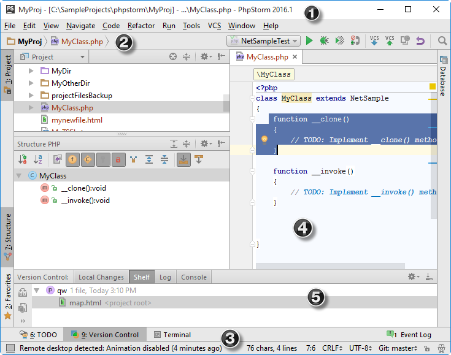

# PhpStorm 界面介绍

本章节将深入的告诉你PhpStorm用户界面是如何组织起来的，以帮助你找到适合你工作环境的方法。

当你首次运行PhpStorm，或者没有打开项目的时候，PhpStorm会显示[欢迎界面](https://www.bookstack.cn/read/phpstorm_trans_cn/$%E5%A6%82%E4%BD%95%E4%BD%BF%E7%94%A8-%E5%B8%B8%E8%A7%84%E6%8C%87%E5%8D%97-%E7%94%A8%E6%88%B7%E7%95%8C%E9%9D%A2%E5%BC%95%E5%AF%BC-%E5%A6%82%E4%BD%95%E4%BD%BF%E7%94%A8-%E5%B8%B8%E8%A7%84%E6%8C%87%E5%8D%97-%E7%94%A8%E6%88%B7%E7%95%8C%E9%9D%A2%E5%BC%95%E5%AF%BC-%E6%AC%A2%E8%BF%8E%E7%95%8C%E9%9D%A2.md)，这可以使你快速的找到主要入口点。当打开项目之后，PhpStorm显示主窗口。

PhpStorm的主窗口由几个逻辑区域组成，如下图所示，标有数字标签：

1. **主菜单和工具栏** — 包含影响整个项目或大部分项目的命令，例如打开、创建项目、重构代码、运行和调试应用程序、版本控制等等。

   主工具栏复制主菜单的基本命令，以便更快地访问。默认情况下主工具栏是隐藏的。要显示它，请选择主菜单中的 **View \| Toolbar**。

2. **导航栏** — [项目工具窗口](https://www.jetbrains.com/help/phpstorm/project-tool-window.html)的快速替代方案 。使用它来[跳转](https://www.jetbrains.com/help/phpstorm/navigating-with-navigation-bar.html)项目并[打开文件编辑](https://www.jetbrains.com/help/phpstorm/using-code-editor.html#find_cursor_edit)。

   使用 **View \| Navigation Bar** 隐藏或显示导航栏; 按 **⌘↑** 将焦点转到导航栏。

3. [**状态栏**](https://www.jetbrains.com/help/phpstorm/status-bar.html)  — 显示项目和整个IDE的状态，并显示各种警告和信息消息。
4. [**编辑器**](https://www.jetbrains.com/help/phpstorm/using-code-editor.html) **** — 在这里您可以查看、创建和修改代码。
5. [**工具窗**](https://www.jetbrains.com/help/phpstorm/tool-windows.html)  — 提供使用各种特定任务的辅助窗口（项目管理，搜索，运行和调试，与版本控制系统集成等）。

