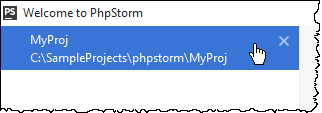

# 欢迎界面

### 概述 {#overview}

当没有项目打开的情况下，PhpStorm将显示欢迎界面，在这个界面中你可以快速的找到主要入口点。这个界面当你在唯一的PhpStorm客户端中关闭当前项目时出现。如果您正打开多个项目，如果你关闭一个项目，只会关闭该项目窗口，除了最后一个项目，关闭它时将会显示欢迎界面。

欢迎界面分为以下两种情况：**快速开始**和**近期项目**\(如果存在\)。

### 快速开始 {#quickstart}

使用链接中的章节 [创建新项目](https://www.jetbrains.com/help/phpstorm/creating-and-managing-projects.html)， 从版本控制[打开](https://www.jetbrains.com/help/phpstorm/opening-reopening-and-closing-projects.html)或 [检出](https://www.jetbrains.com/help/phpstorm/version-control-integration.html)项目。

另外，使用下拉箭头（）**Configure**来 [配置工作环境](https://www.jetbrains.com/help/phpstorm/configuring-project-and-ide-settings.html) 和 [默认项目](https://www.jetbrains.com/help/phpstorm/accessing-default-settings.html)，或者点击**Get Help**打开帮助主题、每日提醒和默认快捷键文档。

### 最近的项目 {#recent}

如果有的话，左边的窗口将显示你最近工作中的项目列表。

> ### 重新打开一个项目 {#d1611932e68}
>
> 在列表中点击项目即可

> ### 查找需要的项目 {#d1611932e72}
>
> 输入它的名字即可
>
>  

> ### 从列表中删除最近的项目 {#delete_recent}
>
> 1. 使用 Tab键将焦点移动到近期项目列表中
> 2. 使用方向箭头选择你想移除的项目，或者像上面的那样找到它
> 3. 执行以下操作之一：
>    * 按键盘上的**Delete**键然后在打开的**Remove Recent Project**对话框中确认删除
>    * 要安静的移除选中的近期项目，点击或者在右键菜单中选择**Remove Selected from Welcome Screen**

