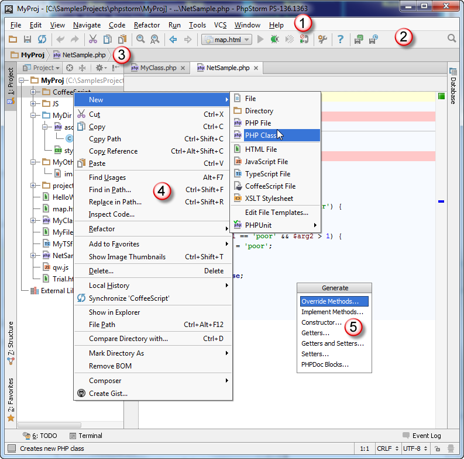

# 菜单和工具栏

### 概述 {#overview}

PhpStorm菜单和工具栏可以让你执行各种命令。主菜单和工具栏包含影响整个项目或大部分项目的命令。此外，项目特定部分的不同的右键弹出菜单可以让你执行的命令，如源文件、类等。几乎每个命令都有一个关联的快捷键，以便让你更快地访问它。

勾选**View**菜单上的命令可以显示或隐藏PhpStorm窗口的主要元素。例如，如果要显示主工具栏，确保**Toolbar**命令是被选中的。

### PhpStorm窗口的主要元素 {#main-concepts-tool-window}

1. **主菜单** 主菜单包含打开、创建项目、重构代码、运行和调试应用程序、文件版本控制等命令。
2. **主工具栏**  
   主工具栏复制了基本命令的按钮，以便你更快地访问。你可以隐藏主工具栏，在主工具栏的右键菜单中选中相应命令。

   默认情况下，主工具栏是隐藏的。要显示它，在主菜单的**View \| Toolbar** 中勾选命令。

3. **导航栏** [导航栏](https://www.jetbrains.com/help/phpstorm/navigation-bar.html)是代替项目工具窗的核心
4. **右键菜单** 这些菜单，可以右键显示出来，包含适用于当前环境的命令
5. 弹出菜单 这些菜单，可以用 **⌘N** 打开，包含适用于当前环境的命令。

### 提示和技巧 {#h2--span-id-span-}

* 使用 **View** 菜单显示或隐藏PhpStorm UI的主要元素；
* 所有菜单和工具栏按钮的操作说明显示在状态栏的左侧；
* 如果你知道要执行哪个操作，但不知道在哪里找到相应的命令，只需按**⇧⌘A**，输入要执行的操作名称的某个部分，然后从建议列表中选择所需的动作。

