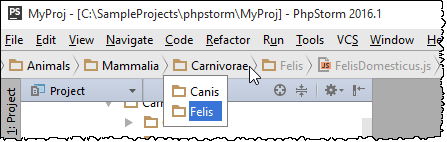

# 导航栏

**View \| Navigation Bar 快捷键⌘↑**

导航栏是代替[项目视图](https://www.bookstack.cn/read/phpstorm_trans_cn/$%E5%A6%82%E4%BD%95%E4%BD%BF%E7%94%A8-%E5%B8%B8%E8%A7%84%E6%8C%87%E5%8D%97-%E7%94%A8%E6%88%B7%E7%95%8C%E9%9D%A2%E5%BC%95%E5%AF%BC-%E5%8F%82%E8%80%83-%E5%B7%A5%E5%85%B7%E7%AA%97%E5%8F%82%E8%80%83-%E9%A1%B9%E7%9B%AE%E5%B7%A5%E5%85%B7%E7%AA%97.md)的核心，你可以使用这个工具[浏览](https://www.bookstack.cn/read/phpstorm_trans_cn/$%E5%A6%82%E4%BD%95%E4%BD%BF%E7%94%A8-%E5%B8%B8%E8%A7%84%E6%8C%87%E5%8D%97-%E7%94%A8%E6%88%B7%E7%95%8C%E9%9D%A2%E5%BC%95%E5%AF%BC-%E5%A6%82%E4%BD%95%E4%BD%BF%E7%94%A8-%E5%B8%B8%E8%A7%84%E6%8C%87%E5%8D%97-%E6%B5%8F%E8%A7%88%E6%BA%90%E4%BB%A3%E7%A0%81-%E4%BD%BF%E7%94%A8%E5%AF%BC%E8%88%AA%E6%A0%8F%E8%B7%B3%E8%BD%AC.md)项目并且[打开文件编辑](https://www.bookstack.cn/read/phpstorm_trans_cn/$%E5%A6%82%E4%BD%95%E4%BD%BF%E7%94%A8-%E5%B8%B8%E8%A7%84%E6%8C%87%E5%8D%97-%E7%94%A8%E6%88%B7%E7%95%8C%E9%9D%A2%E5%BC%95%E5%AF%BC-%E5%A6%82%E4%BD%95%E4%BD%BF%E7%94%A8-%E5%B8%B8%E8%A7%84%E6%8C%87%E5%8D%97-PhpStorm%E7%BC%96%E8%BE%91%E5%99%A8-%E5%9F%BA%E7%A1%80%E7%BC%96%E8%BE%91%E8%A7%84%E7%A8%8B-%E5%9C%A8%E7%BC%96%E8%BE%91%E5%99%A8%E4%B8%AD%E6%89%93%E5%BC%80%E5%92%8C%E9%87%8D%E6%96%B0%E6%89%93%E5%BC%80%E6%96%87%E4%BB%B6.md)。

在右侧，您可以访问 [运行/调试配置](https://www.jetbrains.com/help/phpstorm/run-debug-configuration.html) 选择器，运行按钮  和调试按钮 ，版本控制按钮（如果启用了 [版本控制集成](https://www.jetbrains.com/help/phpstorm/version-control-integration.html)）和 [全局搜索](https://www.jetbrains.com/help/phpstorm/searching-everywhere.html) 放大镜 。

