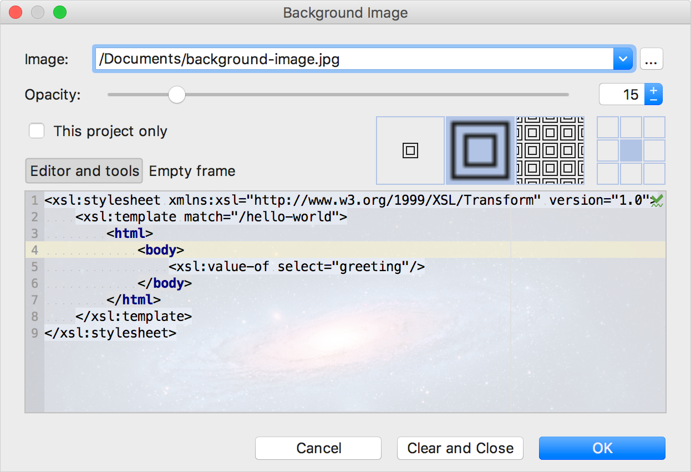

# 设置背景图片

PhpStorm允许你将任何图像设置为背景。你可以仅为当前项目设置背景图片，也可以为打开或新建的任何项目设置背景图片。

这个功能没有快捷键（你可以根据[配置快捷键](https://www.jetbrains.com/help/phpstorm/configuring-keyboard-and-mouse-shortcuts.html)章节的描述很容易的创建一个快捷键）。

设置自定义背景图片：

1. 执行以下操作之一：
   * 按 **Shift** 两次（查看[搜索所有位置](https://www.jetbrains.com/help/phpstorm/searching-everywhere.html)），或按 **⇧⌘A**（查看[跳转到操作](https://www.jetbrains.com/help/phpstorm/navigate-to-action.html)），然后输入**Set background image**搜索字段。
   * 在设置对话框（**⌘,**）中，选择 **Appearance & Behavior \| Appearance** 并点击 **Background Image** 按钮。
2. 在打开的对话框中，设置要用作背景的图像，其不透明度，填充和位置。除此之外，你还可以选择在编辑器和工具窗或PhpStorm框架中显示背景图片。

   此外，选中 This project only 复选框将仅在当前项目中显示背景，在其他项目中忽略此背景。  
     

如果在项目工具窗中选择了图片或在图像编辑器中打开了图片，那么可以在图片的右键弹出菜单中使用 **Set Background Image** 操作。

