# 使用工具窗

PhpStorm**工具窗**附着在工作区的底部和侧面。这些辅助窗口能让你从不同的角度查看项目，并提供访问特定开发任务。这些包括项目管理、代码搜索和导航、运行和调试，与版本控制系统的集成以及许多其他特殊任务。

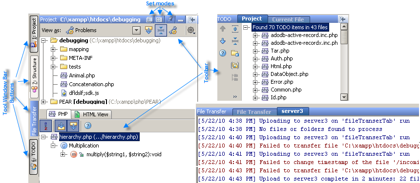

某些工具窗始终可用，即在任何项目中不管项目性质、内容和配置，这些窗口都是可用的。有些工具窗是要开启相应的插件后才可用。还有一些只有在执行某些操作的时候才会出现，比如：查找工具窗，你必须要先搜索某些内容，该窗口才会出现。

### 快速打开工具窗 {#tool_window_quick_access}

在工作区的左下角，有一个按钮看起来像这样  。

如果将鼠标光标悬停在此按钮上，就会打开一个菜单，菜单中选项的名字和工作区的名字一致。当你选择一个选项，相应的工具窗打开并被激活。

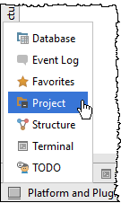

如果单击此按钮，将显示工具窗口栏和按钮。同时按钮，外观切换到。如果再次单击该按钮，则会再次隐藏工具窗口栏和按钮。

### 工具窗栏和按钮 {#bars_and_buttons}

当可见时，工具窗按钮栏（或仅**工具窗栏**）位于工具窗周围（ 如果隐藏工具窗，则位于 [编辑器](https://www.jetbrains.com/help/phpstorm/using-code-editor.html)区域）。这些栏包含用于显示或隐藏工具窗口（工具窗按钮）的按钮。

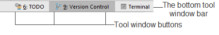

工具窗按钮也提供工具窗的上下文菜单入口，当在按钮上右键单击时显示：

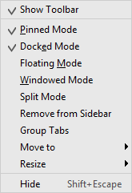

通过上下文菜单，你可以控制工具窗[查看模式](https://www.jetbrains.com/help/phpstorm/viewing-modes.html)以及工具窗其他方面的外观。

首先，有三个工具窗栏，两个在主窗口两侧，一个在底部。你可以通过单击 工作区的左下角一次显示或隐藏所有按钮栏。

每个工具窗按钮都有相应工具窗的名称。在某些按钮上，窗口名称前面可能有一个数字，例如：**1：Project**。这意味着快捷键**Alt+&lt;number&gt;** 或 **⌘+&lt;number&gt;**可用来显示或隐藏窗口。例如，你可以按下 **Alt+1** 或 **⌘+1** 来展示或隐藏项目工具窗。

你可以在[外观设置](https://www.jetbrains.com/help/phpstorm/settings-appearance.html)中修改工具窗访问数字的开发 。

可见工具窗和隐藏工具窗的按钮外观不同：

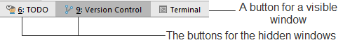

你可以重新排列工具窗通过拖放工具窗按钮到不同的工具窗栏\(或者拖放到相同工具窗栏的不同角落\)。作为结果，工具窗栏附加到你移动窗口按钮到的栏上。

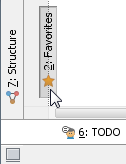

### 通用工具窗布局 {#h2--span-id-span-}

通常，所有的工具窗按照相同的方式组织：

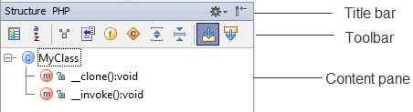

在窗口的顶部是标题栏。右键单击标题栏时，将显示管理该窗口外观和内容的菜单。

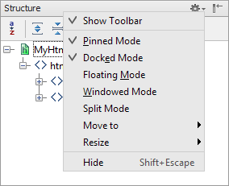

标题栏的右侧部分包含两个按钮。第一个按钮（）是用于管理工具窗口 [查看模式](https://www.jetbrains.com/help/phpstorm/viewing-modes.html)的菜单。注意：这个菜单选项是标题栏上下文菜单的子集。

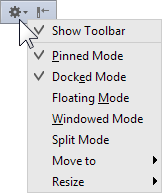

第二个按钮（）用于隐藏工具窗口。与快捷键 **Alt+⌘** 组合使用时，点击这个按钮将隐藏所有关联到相同工具窗栏的窗口。

标题栏下方是工具栏和内容面板。根据窗口，工具栏可能位于内容面板的上方或左侧。

通常，工具栏按钮是由工具窗决定的。但是，有相同目的的窗口可能在工具栏包含类似的操作。

大多数情况下，还可以从主菜单或上下文菜单访问与工具栏按钮相关联的功能，或者有等价的快捷键。

内容面板可能是简单的或者包含两个或更多“图层”\(视图\)，例如，也许有工具窗的内容面板部分显示在编辑器区域的独立标签中。

### 访问工具窗口菜单 {#accessing-tool-windows-menus}

* 使用 **View \| Tool Windows** 菜单显示或隐藏工具窗 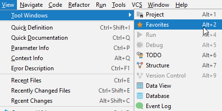
* 使用 **Window \| Active Tool Window** 菜单用于执行与活动工具窗口相关的操作。这些操作包括隐藏活动窗口和其他窗口，更改活动工具窗口的[查看模式](https://www.jetbrains.com/help/phpstorm/viewing-modes.html)等。   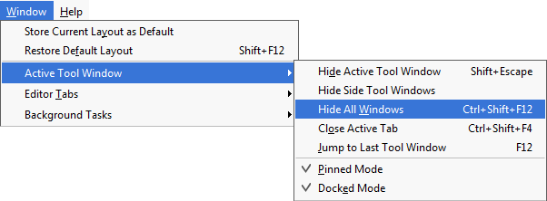 

