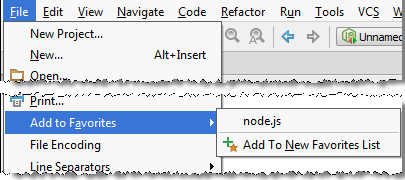

# 管理项目收藏夹

你可以安排经常使用的文件、文件夹、[书签](https://www.jetbrains.com/help/phpstorm/navigating-with-bookmarks.html)和[断点](https://www.jetbrains.com/help/phpstorm/using-breakpoints.html)在收藏列表中。PhpStorm有一个专用的收藏工具窗来管理你的收藏夹。

最开始 ，有一个空的项目同名收藏列表。

你可以根据需要创建更多的收藏列表并管理它们的内容。

### 使用项目工具窗将项目添加到收藏夹

1. 在[项目中](https://www.jetbrains.com/help/phpstorm/project-tool-window.html)，选择要添加到收藏夹的项目。
2. 执行以下操作之一：
   * 按 **⌥⇧F**。
   * 从主菜单选择 **File \| Add To Favorites**
   * 从选中项的右键菜单选择 **Add To Favorites**
3. 要将所选项目添加到现有收藏夹列表，请选择列表名称。  
   要创建新的收藏夹列表并将所选项目**添加**到其中，选择 **Add To New Favorites List**。在 **Add New Favorites List** 对话框中，指定新列表的名称，然后点击**OK**。

   

### 使用编辑器添加项目到收藏 {#h2--span-id-span-}

在编辑器中，你可以添加一个文件（**⌥⇧F**）或所有打开的文件到收藏列表。

1. 右键单击感兴趣的编辑器选项卡，然后选择以下选项之一：
   * 如果要将当前文件**添加到收藏夹**，选择 **Add To Favorites**（对于当前文件， 还可以使用 **File \| Add To Favorites**）
   * 如果要将编辑器中打开的所有文件**添加**到收藏夹，选择 **Add All To Favorites**。
2. 要将项目添加到现有收藏夹列表，请选择列表的名称。  要创建新的收藏夹列表并将项目**添加**到其中，选择 **Add To New Favorites List**。在 **Add New Favorites List** 对话框，指定新列表的名字并点击 **OK**。

### 创建新的收藏夹列表 {#new-favorites-list}

在将[项目添加到收藏夹](https://www.bookstack.cn/read/phpstorm_trans_cn/%E5%A6%82%E4%BD%95%E4%BD%BF%E7%94%A8-%E5%B8%B8%E8%A7%84%E6%8C%87%E5%8D%97-PhpStorm%E5%B7%A5%E5%85%B7%E7%AA%97-%E7%AE%A1%E7%90%86%E9%A1%B9%E7%9B%AE%E6%94%B6%E8%97%8F%E5%A4%B9.md#%E4%BD%BF%E7%94%A8%E9%A1%B9%E7%9B%AE%E5%B7%A5%E5%85%B7%E7%AA%97%E6%B7%BB%E5%8A%A0%E9%A1%B9%E7%9B%AE%E5%88%B0%E6%94%B6%E8%97%8F) 或 将收藏夹列表的项目[移动](https://www.jetbrains.com/help/phpstorm/managing-your-project-favorites.html#move)到其他列表时，你可以选择创建新的收藏夹列表。

你还可以单独创建一个新的（空的）收藏夹列表，作为单独的任务。

1. 打开[收藏工具窗](https://www.bookstack.cn/read/phpstorm_trans_cn/$%E5%A6%82%E4%BD%95%E4%BD%BF%E7%94%A8-%E5%B8%B8%E8%A7%84%E6%8C%87%E5%8D%97-PhpStorm%E5%B7%A5%E5%85%B7%E7%AA%97-%E5%8F%82%E8%80%83-%E5%B7%A5%E5%85%B7%E7%AA%97%E5%8F%82%E8%80%83-%E6%94%B6%E8%97%8F%E5%B7%A5%E5%85%B7%E7%AA%97.md) （⌘2）
2. 执行以下操作之一：
   * 单击工具栏上的 
   * 按 ⌘N
3. 在**Add New Favorites List**对话框，指定新列表的名字然后点击**OK**

### 重命名收藏夹列表 {#h2--span-id-span-}

1. 打开[收藏工具窗](https://www.bookstack.cn/read/phpstorm_trans_cn/$%E5%A6%82%E4%BD%95%E4%BD%BF%E7%94%A8-%E5%B8%B8%E8%A7%84%E6%8C%87%E5%8D%97-PhpStorm%E5%B7%A5%E5%85%B7%E7%AA%97-%E5%8F%82%E8%80%83-%E5%B7%A5%E5%85%B7%E7%AA%97%E5%8F%82%E8%80%83-%E6%94%B6%E8%97%8F%E5%B7%A5%E5%85%B7%E7%AA%97.md) （⌘2）
2. 执行以下操作之一：
   * 右键单击列表中你想修改的名字，然后选择 **Rename Favorites List**
   * 在“ 收藏夹” 工具窗口的工具栏中 ，单击 
3. 在**New Name for Favorites List**对话框，根据需要修改列表的名字然后点击**OK**

### 将项目移动到其他列表 {#move}

1. 打开[收藏工具窗](https://www.bookstack.cn/read/phpstorm_trans_cn/$%E5%A6%82%E4%BD%95%E4%BD%BF%E7%94%A8-%E5%B8%B8%E8%A7%84%E6%8C%87%E5%8D%97-PhpStorm%E5%B7%A5%E5%85%B7%E7%AA%97-%E5%8F%82%E8%80%83-%E5%B7%A5%E5%85%B7%E7%AA%97%E5%8F%82%E8%80%83-%E6%94%B6%E8%97%8F%E5%B7%A5%E5%85%B7%E7%AA%97.md) （⌘2）
2. 右键单击你想移动的列表项目，然后选择 **Send To Favorites**
3. 要移动选择的项目到一个已存在的列表，选择目标列表的名字。 要创建一个新的列表并将项目移动到这，选择 **Send To New Favorites List** 。在 **Add New Favorites List** 对话框，指定新列表的名字并点击 **OK**。

### 从收藏夹中删除项目 {#remove}

要从收藏夹中删除项目，你可以删除相应的收藏夹列表项和/或整个收藏夹列表。

1. 打开[收藏工具窗](https://www.bookstack.cn/read/phpstorm_trans_cn/$%E5%A6%82%E4%BD%95%E4%BD%BF%E7%94%A8-%E5%B8%B8%E8%A7%84%E6%8C%87%E5%8D%97-PhpStorm%E5%B7%A5%E5%85%B7%E7%AA%97-%E5%8F%82%E8%80%83-%E5%B7%A5%E5%85%B7%E7%AA%97%E5%8F%82%E8%80%83-%E6%94%B6%E8%97%8F%E5%B7%A5%E5%85%B7%E7%AA%97.md) （⌘2）
2. 选择要从收藏夹中删除的项目。请注意，你可以同时选择单独的列表项和整个列表。
3. 执行以下操作之一：
   * 单击工具栏上的 
   * 在右键菜单选择 **Remove From Favorites**（如果当前选中了单个收藏列表，注意还有其他选项：**Delete Favorites List**  **&lt;list\_name&gt;** 和 **Delete All Favorites Lists Except**  **&lt;list\_name&gt;**  ）
   * 按 **⌦**

