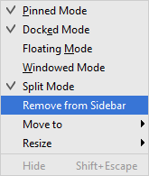
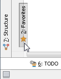
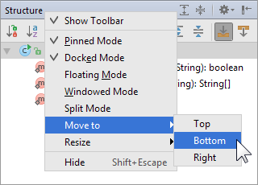
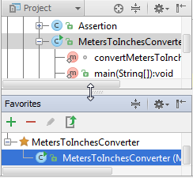

# 操作工具窗

### 显示工具窗 {#h2--span-id-span-}

执行以下操作之一：

* 在工作区左下角，指向，然后在显示的菜单中选择工具窗；
* 在[工具窗栏](https://www.bookstack.cn/read/phpstorm_trans_cn/$%E5%A6%82%E4%BD%95%E4%BD%BF%E7%94%A8-%E5%B8%B8%E8%A7%84%E6%8C%87%E5%8D%97-PhpStorm%E5%B7%A5%E5%85%B7%E7%AA%97-%E5%A6%82%E4%BD%95%E4%BD%BF%E7%94%A8-%E5%B8%B8%E8%A7%84%E6%8C%87%E5%8D%97-PhpStorm%E5%B7%A5%E5%85%B7%E7%AA%97-README.md)点击相应的工具窗；
* 在主菜单选择 **View \| Tool Windows \| &lt;tool window&gt;；**
* 如果工具窗已经关联到一个快速访问数字，请按 Alt（对于Windows和Linux用户）或⌘（对于macOS用户），**例如：**对于项目工具窗，按Alt+1（对于Windows或Linux用户）或⌘+1（对于macOS用户） 。

### 隐藏单个工具窗口 {#hide}

执行以下操作之一：

* 在[工具窗栏](https://www.bookstack.cn/read/phpstorm_trans_cn/$%E5%A6%82%E4%BD%95%E4%BD%BF%E7%94%A8-%E5%B8%B8%E8%A7%84%E6%8C%87%E5%8D%97-PhpStorm%E5%B7%A5%E5%85%B7%E7%AA%97-%E5%A6%82%E4%BD%95%E4%BD%BF%E7%94%A8-%E5%B8%B8%E8%A7%84%E6%8C%87%E5%8D%97-PhpStorm%E5%B7%A5%E5%85%B7%E7%AA%97-README.md)点击相应的工具窗按钮；
* 在工具窗标题栏单击；
* 右键单击相应的工具窗按钮，从上下文菜单中选择 **Hide**；
* 右键单击工具窗标题栏，从上下文菜单中选择 **Hide**；
* 在主菜单中选择 **View \| Tool Windows \| &lt;tool window&gt;**；
* 如果工具窗已经关联到一个快速访问数字，请按 **Alt**（对于Windows和Linux用户）或 **⌘**（对于macOS用户），**例如：**对于项目工具窗，按Alt+1（对于Windows或Linux用户）或⌘+1（对于macOS用户） ；
* 如果要隐藏的工具窗口当前处于活动状态，请按 **⇧⎋。**

### 隐藏附加在同侧工具栏的所有工具窗 {#h2--span-id-span-}

执行以下操作之一：

* 按住 **Alt**（对于Windows和Linux用户）或 **⌘** （对于macOS用户），然后点击附加在工具窗栏上任意工具窗的；
* 在主菜单选择 **Window \| Active Tool Window \| Hide Side Tool Windows**。这个命令隐藏当前活动工具窗或最后激活的工具窗附加的工具窗栏中所有的工具窗。

### 隐藏所有工具窗 {#hiding-all-tool-windows}

执行以下操作之一：

* 在主菜单中选择 **Window \| Active Tool Window \| Hide All Windows**；
* 按 **Ctrl+Shift+F12**（对于Windows和Linux用户）或 **⇧⌘F12** （对于macOS用户）

### 切换到最后活动工具窗 {#h2--span-id-span-}

执行以下操作之一：

* 在主菜单中选择 **Window \| Active Tool Window \| Jump to Last Tool Window**；
* 按 **F12**

### 隐藏或显示工具窗栏 {#show-all}

如果你的PhpStorm窗口中需要更多空间，则可以隐藏所有工具窗口栏：

* 在工作区的左下角，单击。

如果隐藏了工具窗口栏，您可以将它们永久地或短时间带回屏幕：

* 要重置工具窗栏，点击工作区左下角的
* 要在短时间内查看工具窗口栏，双击并按住 **Alt**（对于Windows和Linux用户）或 **⌘**（对于macOS用户）。工具窗栏在屏幕出现并使得工具窗按钮可见，当你释放该键后工具窗栏又隐藏了。

### 隐藏工具窗口按钮 {#tw_button}

PhpStorm可以隐藏单独的工具窗按钮，而不用卸载相应的插件。

要从视图中移除一个工具窗按钮：

1. 确保[工具窗栏是可见](https://www.bookstack.cn/read/phpstorm_trans_cn/%E5%A6%82%E4%BD%95%E4%BD%BF%E7%94%A8-%E5%B8%B8%E8%A7%84%E6%8C%87%E5%8D%97-PhpStorm%E5%B7%A5%E5%85%B7%E7%AA%97-%E6%93%8D%E4%BD%9C%E5%B7%A5%E5%85%B7%E7%AA%97.md#%E9%9A%90%E8%97%8F%E6%88%96%E5%B1%95%E7%A4%BA%E5%B7%A5%E5%85%B7%E7%AA%97%E6%A0%8F)的
2. 右键单击你想要隐藏的工具窗按钮
3. 选择 **Remove from Sidebar**

要重置隐藏的工具窗按钮，在主菜单选择 **View \| Tool Windows**，然后点击在工具窗栏中隐藏了的工具窗

### 将工具窗附加到其他工具窗栏 {#move}

执行以下操作之一：

* 拖动相应的工具窗按钮到目标工具窗栏上（上、左、下、右）   
* 右键单击相应的工具窗按钮或工具窗标题栏来打开上下文菜单。选择 **Move to** 然后选择目标工具窗栏（上、左、下、右）   

### 调整工具窗的大小 {#resize}

* 将鼠标指针停留在工具窗边界，当指针变为双头箭头时，沿所需方向拖动边框   
* 你也可以调整工具窗的大小通过逐渐的向上向下向左向右的移动它的边框。以下选择可用来做这个：
  * 右键单击相应的工具窗按钮或标题栏然后选择**Resize**。然后选中一个可用的**Stretch to**选项
  * 激活工具窗，执行以下操作之一：
    * 选择 **Window \| Active Tool Window \| Resize**, 然后选择必要的拉伸到选项
    * 按**Ctrl+Shift**，配合相应的箭头键

### 增加一次同时显示的工具窗数目 {#h2--span-id-span-}

要增加一次同时显示的工具窗数目，应适当设置不同工具窗口的[查看模式](https://www.bookstack.cn/read/phpstorm_trans_cn/$%E5%A6%82%E4%BD%95%E4%BD%BF%E7%94%A8-%E5%B8%B8%E8%A7%84%E6%8C%87%E5%8D%97-PhpStorm%E5%B7%A5%E5%85%B7%E7%AA%97-%E5%A6%82%E4%BD%95%E4%BD%BF%E7%94%A8-%E5%B8%B8%E8%A7%84%E6%8C%87%E5%8D%97-PhpStorm%E5%B7%A5%E5%85%B7%E7%AA%97-%E6%9F%A5%E7%9C%8B%E6%A8%A1%E5%BC%8F.md)。考虑以下几点：

* 通常，要使一个工具窗总是可见的（即使在非活动状态下），应锁定工具窗口
* 没有限制可见[浮动](https://www.bookstack.cn/read/phpstorm_trans_cn/$%E5%A6%82%E4%BD%95%E4%BD%BF%E7%94%A8-%E5%B8%B8%E8%A7%84%E6%8C%87%E5%8D%97-PhpStorm%E5%B7%A5%E5%85%B7%E7%AA%97-%E5%A6%82%E4%BD%95%E4%BD%BF%E7%94%A8-%E5%B8%B8%E8%A7%84%E6%8C%87%E5%8D%97-PhpStorm%E5%B7%A5%E5%85%B7%E7%AA%97-%E6%9F%A5%E7%9C%8B%E6%A8%A1%E5%BC%8F.md#%E5%9B%BA%E5%AE%9A%E6%B5%AE%E5%8A%A8%E5%92%8C%E7%AA%97%E5%8F%A3%E5%8C%96%E6%A8%A1%E5%BC%8F)窗口和窗口化窗口的数量。注意窗口化模式在OS X系统中不可用
* 要在同一时刻在同一个工具窗栏看到两个\(或以上\)[停靠](https://www.bookstack.cn/read/phpstorm_trans_cn/$%E5%A6%82%E4%BD%95%E4%BD%BF%E7%94%A8-%E5%B8%B8%E8%A7%84%E6%8C%87%E5%8D%97-PhpStorm%E5%B7%A5%E5%85%B7%E7%AA%97-%E5%A6%82%E4%BD%95%E4%BD%BF%E7%94%A8-%E5%B8%B8%E8%A7%84%E6%8C%87%E5%8D%97-PhpStorm%E5%B7%A5%E5%85%B7%E7%AA%97-%E6%9F%A5%E7%9C%8B%E6%A8%A1%E5%BC%8F.md#%E5%81%9C%E9%9D%A0%E5%92%8C%E5%8F%96%E6%B6%88%E5%81%9C%E9%9D%A0%E6%A8%A1%E5%BC%8F)的窗口。一个应该开启[分割模式](https://www.bookstack.cn/read/phpstorm_trans_cn/$%E5%A6%82%E4%BD%95%E4%BD%BF%E7%94%A8-%E5%B8%B8%E8%A7%84%E6%8C%87%E5%8D%97-PhpStorm%E5%B7%A5%E5%85%B7%E7%AA%97-%E5%A6%82%E4%BD%95%E4%BD%BF%E7%94%A8-%E5%B8%B8%E8%A7%84%E6%8C%87%E5%8D%97-PhpStorm%E5%B7%A5%E5%85%B7%E7%AA%97-%E6%9F%A5%E7%9C%8B%E6%A8%A1%E5%BC%8F.md#%E5%88%86%E5%89%B2%E6%A8%A1%E5%BC%8F)，另一个应该关闭分割模式
* 起先，三个\(不是四个\)工具窗栏可用。你可以激活第四个工具窗栏\(顶部的那个\)通过[移动](https://www.jetbrains.com/help/phpstorm/manipulating-the-tool-windows.html#move)某个工具窗到它上面

### 保存和重置工具窗排布 {#h2--span-id-span-}

你可以在主菜单选择**Window \| Store Current Layout as Default**来保存你当前工具窗排布情况

在后面的某个时候，你可以回退到保存的工作区布局通过选择 **Window \| Restore Default Layout**

