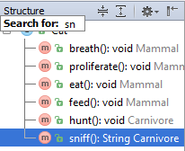

# 在工具窗快速搜索

**工具窗的快速搜索**可以帮助你查找和跳转到**项目**工具栏的文件或目录、**结构**工具窗的成员、**版本控制**工具窗的变更列表、**TODO**列表中的项目等等。

注意，快速搜索仅在展开的节点中搜索，如果节点折叠起来了，它里面的项目不能被检测到。

要搜索工具窗口，请按照下列步骤操作：

1. 选择所需的工具窗口
2. 开始输入项目名称（例如：文件、类、字段等）。在你输入时，搜索字段将显示在工具窗口工具栏上，显示输入的字符，元素选择将移至与指定字符串匹配的第一个项目，字符串的匹配部分高亮显示。   
3. 如果有多个相邻项目与模式匹配，使用键盘上的向上和 向下键在它们之间跳转。
4. 准备好了以后按**Enter**。作为结果，匹配的项目在工具窗中被选中。按 **Esc** 隐藏搜索字段

