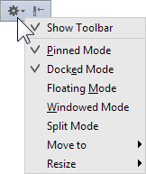

# 查看模式

0                                                         ，                                        PhpStorm提供各种视图模式可以让你控制工具窗的显示和行为。这些模式帮助你在快速和方便访问工具窗之间保持适当平衡，并最大化你编辑代码的屏幕空间。

你可以在PhpStorm设置的 **Appearance & Behavior \| Appearance** 的 ****[Window Options](https://www.jetbrains.com/help/phpstorm/settings-appearance.html#window_options) 为工具窗配置一些查看选项。

可以为每个工具窗口单独配置下面描述的一些视图模式。

### 控制视图模式的方法 {#h2--span-id-span-}

通过打开或关闭相应的查看选项来设置视图模式。要访问这些选项，您可以使用：

* 在工具窗的标题栏上的选项   
* 上下文菜单。右键单击工具窗口按钮或工具窗口标题栏可访问上下文菜单   
* 对于活动窗口：**Window \| Active Tool Window**菜单

### 停靠和取消停靠模式 {#h2--span-id-span-}

处于[固定模式](https://www.jetbrains.com/help/phpstorm/viewing-modes.html#floating)的工具窗口可以**停靠**或**取消停靠**。

在停靠模式下，所有的工具窗边附着在周围元素上（编辑器，其他工具窗等等），这样，工具窗和相邻元素共享主窗口中可用的空间。

当停靠的工具窗口变为非活动状态时，它将保持可见或隐藏，具体取决于窗口是 [固定还是非固定](https://www.jetbrains.com/help/phpstorm/viewing-modes.html#pinned)。

最开始，所有的工具窗是停靠模式（即停靠模式是打开的）。

取消停靠时，工具窗的所有侧面（工具窗口栏上的除外）都与周围元素分离。窗口移动到“上一层”，覆盖了与它共享空间的元素。在其中一个方向（沿工具窗栏），伸长并占据所有可用空间。在另一个方向上，其中一个窗口边框变得松散并且可以移动而不会影响其他底层元素的大小。

当未停靠的工具窗口变为非活动状态时，它将自动隐藏。

要在停靠模式和未停靠模式之间切换，请打开或关闭 **Docked Mode** 选项。

### 固定、浮动和窗口化模式 {#h2--span-id-span-}

一个工具窗栏可以是_**固定**_的。在这种情况下，它停留在主窗口中。

或者，工具窗口可以处于 _**浮动**_ 或 _**窗口**_ 模式。

当处于固定模式时，工具窗的一侧连接到其中一个工具窗。这个行为取决于窗口是[停靠还是未停靠](https://www.jetbrains.com/help/phpstorm/viewing-modes.html#docked)。

最开始，所有的窗口都是处于固定模式（即浮动和窗口模式关闭）。

在浮动和窗口模式中，工具窗可以移动到屏幕的任意位置。

要切换到浮动模式或窗口模式，请启用 **Floating Mode** 或 **Windowed Mode** 选项。要将工具窗口恢复为固定模式，请关闭 **Floating Mode** 或 **Windowed Mode** 选项。

请注意，对于窗口模式下的工具窗将禁用 **Window** 菜单的 **Hide Active Tool Window**。

### 固定/取消固定模式 {#pinned}

通常，固定工具窗在变为非活动状态时也会保持可见。 在这种情况下，未固定的工具窗口会自动隐藏。

最开始，所有的工具窗是固定的（即固定模式已打开）

相比其他视图模式，可能有轻微的行为差别：

* [取消停靠](https://www.bookstack.cn/read/phpstorm_trans_cn/%E5%A6%82%E4%BD%95%E4%BD%BF%E7%94%A8-%E5%B8%B8%E8%A7%84%E6%8C%87%E5%8D%97-PhpStorm%E5%B7%A5%E5%85%B7%E7%AA%97-%E6%9F%A5%E7%9C%8B%E6%A8%A1%E5%BC%8F.md#%E5%81%9C%E9%9D%A0%E5%92%8C%E5%8F%96%E6%B6%88%E5%81%9C%E9%9D%A0%E6%A8%A1%E5%BC%8F)的工具窗在不活动时始终隐藏（在未停靠模式下，工具窗口实际上是取消固定的）。
* [浮动](https://www.bookstack.cn/read/phpstorm_trans_cn/%E5%A6%82%E4%BD%95%E4%BD%BF%E7%94%A8-%E5%B8%B8%E8%A7%84%E6%8C%87%E5%8D%97-PhpStorm%E5%B7%A5%E5%85%B7%E7%AA%97-%E6%9F%A5%E7%9C%8B%E6%A8%A1%E5%BC%8F.md#%E5%9B%BA%E5%AE%9A%E6%B5%AE%E5%8A%A8%E5%92%8C%E7%AA%97%E5%8F%A3%E5%8C%96%E6%A8%A1%E5%BC%8F)的固定工具窗在不活动时可能变为半透明。

要在固定模式和未固定模式之间切换，请打开或关闭 **Pinned Mode** 选项。

### 分割模式 {#h2--span-id-span-}

此模式与一次显示[停靠](https://www.jetbrains.com/help/phpstorm/viewing-modes.html#docked)在同一工具窗口栏上的窗口数量（一个或两个）有关。

通常，工具窗栏边沿的空间在两组停靠的工具窗之间共享。

在某组工具窗的分割模式关闭的时候，另一组的也在这个模式。

在任何时候，每组窗口只有一个可见。

因此，如果所有窗口都停靠在一个工具窗栏并关闭了分割模式，那么一次只有一个工具窗可见。在这种情况下，可见的工具窗占据了工具窗栏的所有可用空间。所以当你想要某个窗口可见，之前的窗口自动隐藏。

如果所有工具窗停靠在相同的工具窗栏并全都开启了分割模式，那么你会观察到相同的行为。

为了能够同时看到两个窗口，相应的窗口应该属于不同的组，也就是说，其中一个窗口应该关闭分割模式而另一个窗口应该打开。

工具窗的工具窗按钮处于不同的分割模式设置并在相应工具窗栏的不同角落显示，对于垂直窗口区域，关闭分割模式的窗口的按钮位于顶部; 对于水平区域，这些窗口的按钮位于左上角。

要切换分割模式，请使用窗口标题栏上下文菜单中的 **Split Mode** 选项。

### 组标签选项 {#h2--span-id-span-}

工具窗中中有多个视图可用，如果 **Group Tabs** 选项处于关闭状态，那么相应的视图可能显示在独立的标签，如果该选项开启，这些视图从列表中选择。

### 支持宽屏 {#h2--span-id-span-}

PhpStorm可以让工具窗使用全屏幕的宽度和高度，在设置对话框，展开节点**Appearance and Behaviour**，然后在[Appearance](https://www.bookstack.cn/read/phpstorm_trans_cn/$%E5%A6%82%E4%BD%95%E4%BD%BF%E7%94%A8-%E5%B8%B8%E8%A7%84%E6%8C%87%E5%8D%97-PhpStorm%E5%B7%A5%E5%85%B7%E7%AA%97-%E5%8F%82%E8%80%83-%E8%AE%BE%E7%BD%AE%E5%8F%82%E6%95%B0%E5%AF%B9%E8%AF%9D%E6%A1%86-%E5%A4%96%E8%A7%82%E8%A1%8C%E4%B8%BA-%E5%A4%96%E8%A7%82.md)页面，使用复选框**Wide screen tool window layout**和**Side by side layout on the left/right**来组织工具窗的布局。

另请注意，你可以通过 **Ctrl+鼠标点击** 工具窗口之间的拆分器打开或关闭靠边布局。

有关详细信息，请参阅[ 宽屏工具窗口布局](https://www.jetbrains.com/help/phpstorm/settings-appearance.html#wide)。

