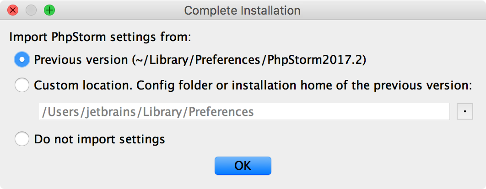
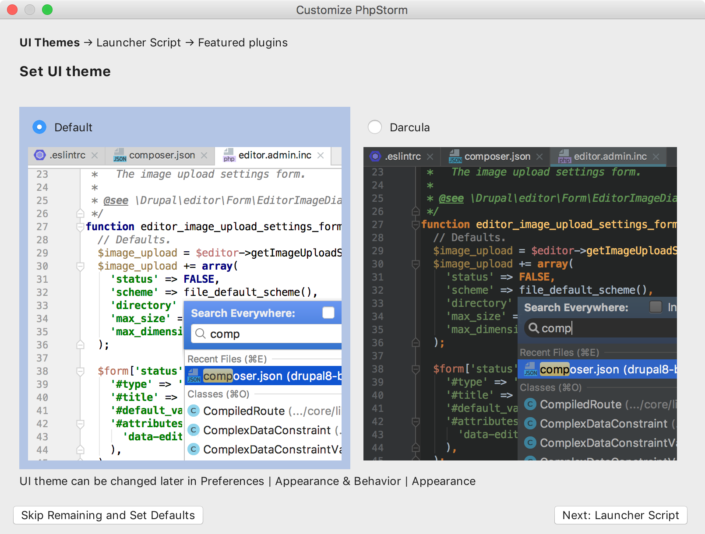
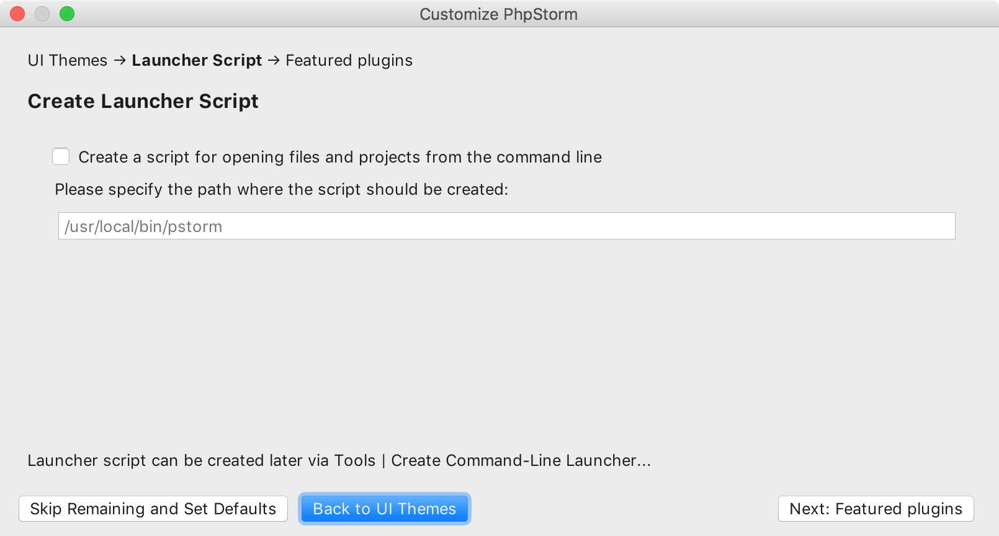
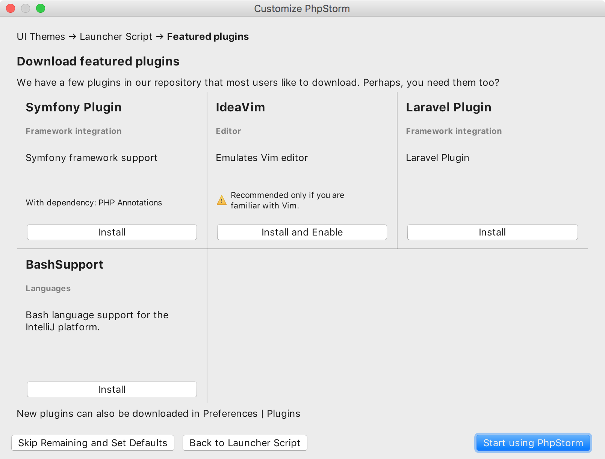
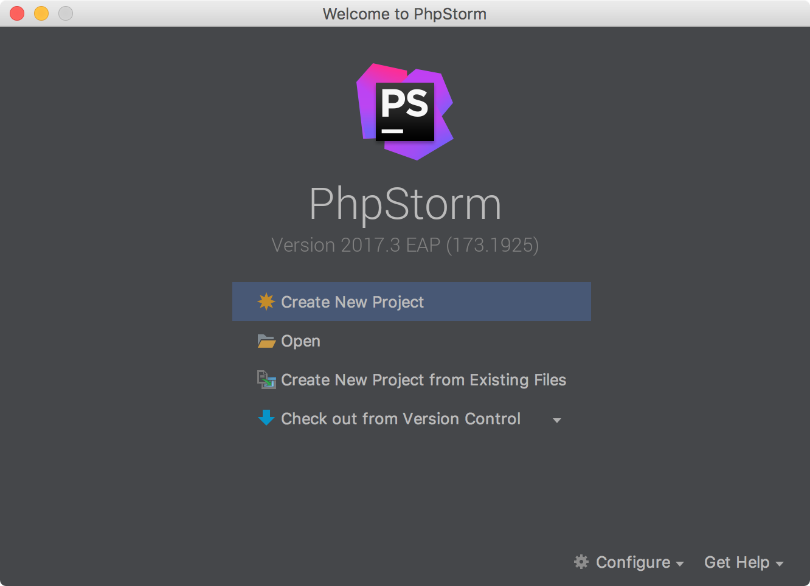
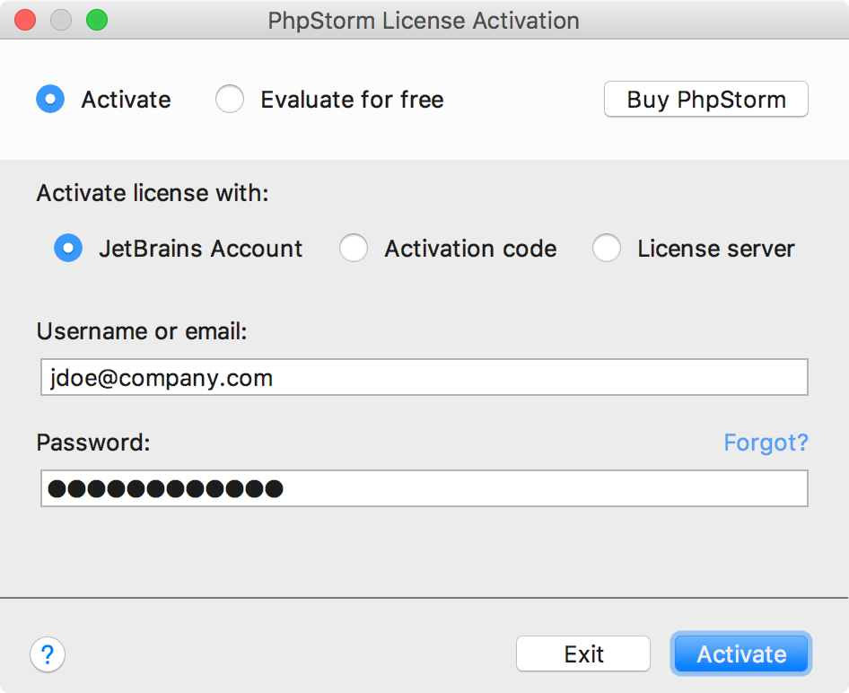
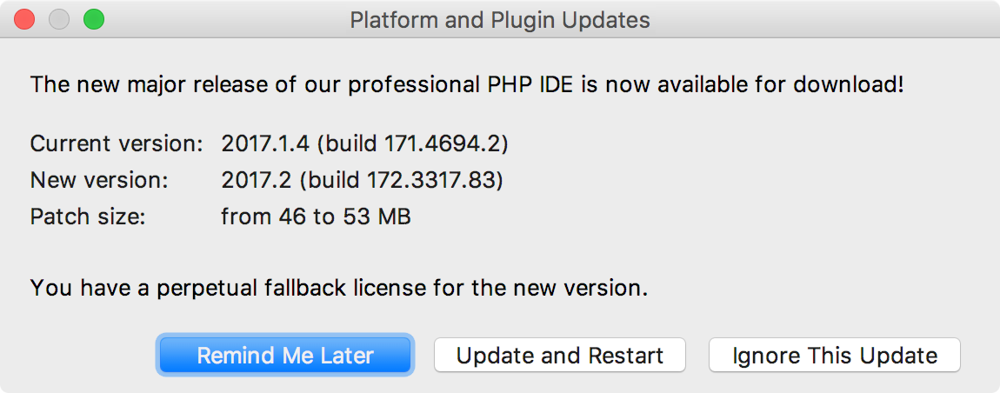
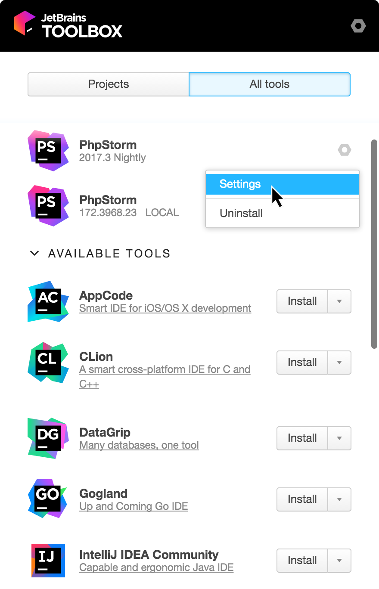

# 安装和设置

### 安装要求

#### 硬件要求

* 内存：最少2G内存，推荐4G
* 硬盘：硬盘空间不低于2.5G
* 显示器：分辨率不低于1024x768

#### 系统要求

JRE 1.8 已集成于 PhpStorm 发行版，不需要在计算机上安装JAVA环境来运行PhpStorm。

| Windows | macOS | Linux |
| :--- | :--- | :--- |
| Microsoft Windows 10 / 8 / 7\(SP1\) / Vista\(SP2\) 32位 或 64位 | macOS 10.8.3 或 更高版本仅支持64位系统 | 推荐64位linux系统建议使用KDE，Gnome或Unity桌面环境GCC / C ++或Clang |

### 下载并安装PhpStorm {#install-PhpStorm}

1. [下载](http://www.jetbrains.com/phpstorm/download/) 适用于您的操作系统的[PhpStorm](http://www.jetbrains.com/phpstorm/download/)。
2. 根据您的操作系统执行以下操作：

* Windows 安装：
  1. 运行下载的 **PhpStorm-\*.exe**；
  2. 按照安装向导中的说明进行操作。
* macOS 安装：
  1. 打开下载的 **PhpStorm-\*.dmg**；
  2. 将 **PhpStorm** 拖到 **Applications** 文件夹中。
* Linux 安装：
  1. 解压 **PhpStorm-\*.tar.gz**，如果下载文件所在文件夹不支持文件执行，请将已下载的文件解压缩到其他文件夹。 `tar xfz PhpStorm-*.tar.gz <new_archive_folder>` 根据文件系统层次结构标准（FHS）推荐的安装位置是 `/opt`。要将PhpStorm安装到此目录中，请输入以下命令： `sudo tar xfz PhpStorm-*.tar.gz -C /opt/`
  2. 切换到 **bin** 子目录：
  3. **PhpStorm.sh** 从 **bin** 子目录运行。

早期的PhpStorm版本可在[Previous PhpStorm Releases](https://confluence.jetbrains.com/display/PhpStorm/Previous+PhpStorm+Releases) 页面下载 。

### 首次运行PhpStorm {#first-run}

#### 导入PhpStorm设置 {#d657196e171}

当你第一次启动PhpStorm时，或者从先前版本升级后，将打开 **完成安装**\(**Complete Installation\)** 对话框，在该对话框中可以选择是否要导入IDE设置：



  
如果这是你第一次使用PhpStorm，请选择 **不导入设置\(Do not import settings\)** 选项。

#### 选择用户界面主题 {#d657196e203}

接下来，系统将提示你选择UI主题。你可以选择 **Default** 或 **Darcula** 主题：



#### 创建启动脚本



对于Linux和macOS用户，PhpStorm建议通过指定目录或文件名来使用命令行来打开项目和单独的文件。

* 选中 **Create a script for opening files and projects from the command line** \(**创建一个从命令行打开文件和项目的脚本**\)，并指定要创建的命令行启动脚本的名称。

Windows用户不需要指定命令行工具就可以完成安装，以后要从命令行打开文件或项目，使用项目或文件名作为命令行参数启动\* .exe文件就足够了。

#### 下载并安装其他插件 {#additional_plugins}

在下一步中，PhpStorm会提示你从[PhpStorm插件库](https://plugins.jetbrains.com/phpstorm)下载并安装插件。



#### 在PhpStorm中启动项目 {#start-project}

完成初始PhpStorm配置后，将显示**欢迎**界面。你可以进行以下操作：

* [创建新项目](https://www.jetbrains.com/help/phpstorm/creating-and-managing-projects.html)
* [打开现有项目](https://www.jetbrains.com/help/phpstorm/opening-reopening-and-closing-projects.html)
* [查看版本控制系统中的现有项目\(从远程存储库克隆\)](https://www.jetbrains.com/help/phpstorm/version-control-integration.html)



### 注册PhpStorm {#register-IDEA}

为了尝试和评估PhpStorm，您可以免费下载并安装试用版。试用版的有效期为30天，因此您需要获得并注册许可证。

1. 选择以下方法注册PhpStorm：

   * 在欢迎界面上，单击 **Configure \| Manage License\(配置 \| 管理许可证\)**
   * 从主菜单选择 **Help \| Register\(帮助 \| 注册\)**

   \*\*\*\*

   

2. 在打开的对话框中选择激活的类型
   * **JetBrains Account：** 如果你有 [JetBrains 账号](https://account.jetbrains.com/login) ，请选择该选项，你可以购买和管理你的许可证 \(查看 [什么是 JetBrains 账号?](https://sales.jetbrains.com/hc/en-gb/articles/208459005-What-is-JetBrains-Account-) 了解更多信息\)。
   * **Activation code：**如果你有PhpStorm激活码，请选择此选项，然后将激活码粘贴到文本区域。
   * **License server：**选择此选项可通过许可证服务器注册PhpStorm，你可以通过许可证服务器管理许可证并向无法直接访问Internet的用户颁发许可证。 如果要在PhpStorm 初始化启动期间重写系统代理的URL，请使用-Djba.http.proxy属性，该属性可以添加为JVM选项。 当在多台机器上执行静默安装或管理PhpStorm安装时，可以设置JETBRAINS\_LICENSE\_SERVER环境变量，将安装指向许可证服务器URL。

### 更新PhpStorm {#update}

将PhpStorm安装配置为自动检查更新。当有新版本时，它会通知你：



  
PhpStorm通常基于补丁进行更新：点击 **Update and Restart \(重启更新\)**  即可，重新启动IDE即可完成安装。请注意，这些补丁只能按顺序逐个安装。如果忽略或跳过更新，则无法进行后续更新。在这种情况下更新PhpStorm将需要下载并重新安装它，或者使用 **Ignored updates \(忽略更新列表\)** [逐个更新](https://www.jetbrains.com/help/phpstorm/keep-product-up-to-date.html#apply_patch)。

如果补丁下载需要很长时间，你可以将它隐藏到后台并继续工作。下载完成后，系统将提示您重新启动，完成更新。

如果由于某些原因不想安装建议的更新，可以在更新对话框中单击 Ignore This Update（忽略此更新）来忽略该更新。被忽略的版本号将被添加到忽略更新列表中，在从列表中删除此版本号之前，系统不会提示您安装此版本。

### 通过Toolbox App管理PhpStorm {#toolbox-app}

**Toolbox App**是一个控制面板，允许你管理所有JetBrains产品，包括PhpStorm。它允许您维护同一工具的不同版本，安装更新并在需要时回滚。它还会记住您的JetBrains帐户，并在安装和注册新工具时自动登录。

1. 下载 [Toolbox App](https://www.jetbrains.com/toolbox/app/)；
2. 启动安装文件；
3. 安装完成后，接受JetBrains隐私政策并登录JetBrains帐户。

现在，您可以管理现有工具，安装新工具和下载更新：



### 在Windows上执行静默安装

无需任何用户界面即可执行静默安装。网络管理员可以使用它在多台计算机上安装PhpStorm，避免中断其他用户。

如果要使用静默安装，请使用下面的命令运行安装程序：

* /S：启用静默安装
* /D：指定安装目录的路径
* /CONFIG：指定[静默配置文件](https://www.jetbrains.com/help/phpstorm/install-and-set-up-product.html#silent-config)的路径

例如：

```bash
PhpStorm-*.exe /S /CONFIG=d:\temp\silent.config /D=d:\IDE\PhpStorm
```

#### 静默配置文件 {#silent-config}

你可以在[https://download.jetbrains.com/webide/silent.config](https://download.jetbrains.com/webide/silent.config)下载PhpStorm的静默配置文件。

静默配置文件定义了安装PhpStorm的选项。使用默认选项，仅对当前用户执行静默安装（**mode=user**）。如果要为所有用户安装PhpStorm，请使用文本编辑器打开静默配置文件，更改安装模式选项（**mode=admin**）的值并以管理员身份运行安装程序。

#### 静默卸载PhpStorm {#d657196e513}

如果要以静默方式卸载PhpStorm，请`/S`以管理员身份使用交换机运行卸载程序。卸载程序位于 `bin` 下的安装目录中。

以管理员身份运行**cmd**\(Windows命令提示符\)，切换到PhpStorm安装目录，然后运行以下命令：

```bash
bin\uninstall.exe /S
```

### 在Linux上将PhpStorm作为snap package安装 {#install-on-linux-with-snaps}

可以在Linux上将PhpStorm安装为独立的[snap package](https://snapcraft.io/)。由于snap package会自动更新，因此你的PhpStorm将始终保持最新状态。

PhpStorm通过两个渠道发布：

* _stable_ 通道只包括稳定版本。如果要安装最新的PhpStorm稳定版，请执行以下命令： `$ sudo snap install phpstorm --classic`
* _edge_ 通道包含EAP版本。如果要安装最新的PhpStorm EAP版本，请执行以下命令： `$ sudo snap install phpstorm --classic --edge`

当你安装好snap后，你可以运行 **phpstorm** 命令启动。

如果要列出所有已安装的snap包，请运行`sudo snap list`。了解更多信息，请参阅[Snapcraft文档](https://docs.snapcraft.io/)。

