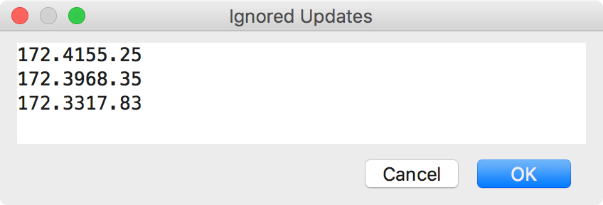
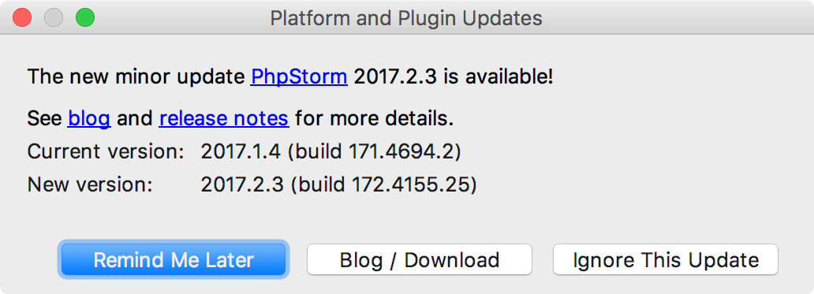
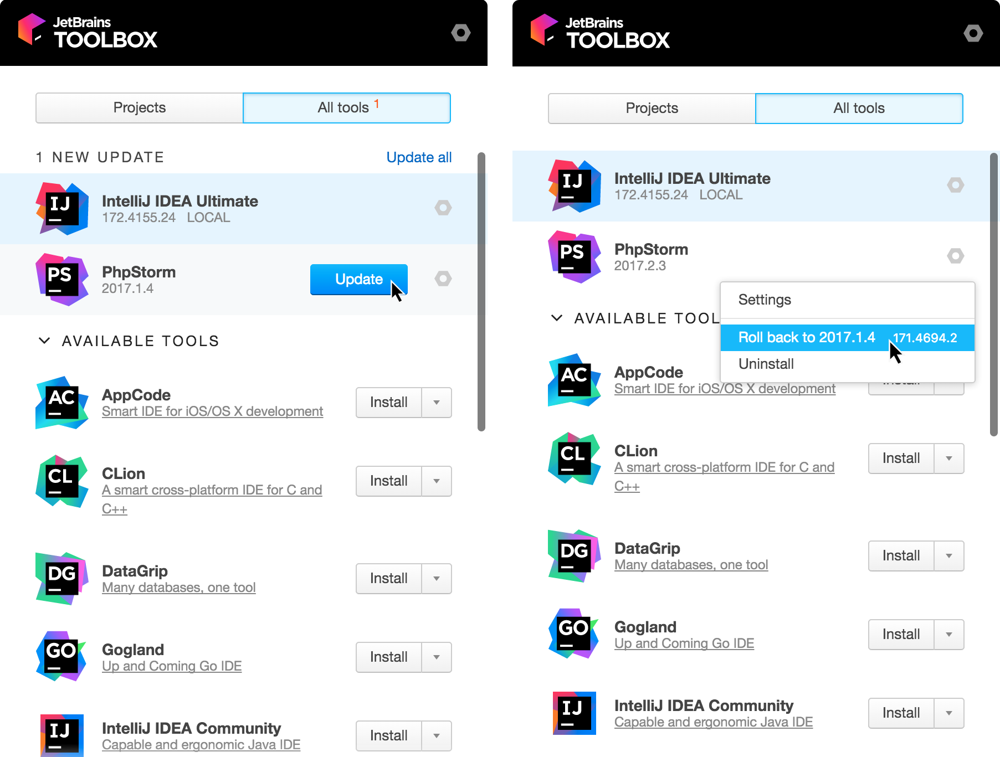
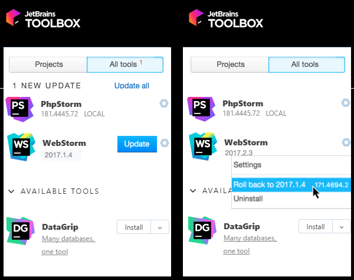

# PhpStorm 更新

### 基础 {#d686075e5}

### 手动管理更新 {#manage_updates_manually}

你可以在 [Settings / Preferences](https://www.jetbrains.com/help/phpstorm/settings-preferences-dialog.html) 对话框中的 **Updates** 页面管理更新。

> ### 如果要管理更新，请根据以下步骤操作： {#d686075e68}
>
> 1. 在 **Settings/Preferences** 对话框中 \(快捷键⌘,\)，点击 **Appearance and Behavior**，然后点击 **System Settings** 下面的 **Updates**
> 2. 根据您的需要执行以下操作：
>    * [手动检查更新](https://www.jetbrains.com/help/phpstorm/keep-product-up-to-date.html#check_updates)
>    * 启用或禁用[自动更新](https://www.jetbrains.com/help/phpstorm/keep-product-up-to-date.html#enable_auto_update)
>    * 选择要从中接收更新的[更新通道](https://www.jetbrains.com/help/phpstorm/keep-product-up-to-date.html#choose_update_channel)
>    * 管理[忽略的更新](https://www.jetbrains.com/help/phpstorm/keep-product-up-to-date.html#manage_ignored_updates)列表
>    * 确保PhpStorm [可以接收基于补丁的更新](https://www.jetbrains.com/help/phpstorm/keep-product-up-to-date.html#apply_patch)

#### 检查更新

如果要检查更新，请执行以下任一操作：

* 单击 **Check Now** 按钮
* 主菜单上的 **Help \| Check for Updates** \(Windows or LINIX\) 或者 **PhpStorm \| Check for Updates** \(macOS\)

#### 启用自动更新 {#enable_auto_update}

这些设置允许您启用自动更新：

* 选中 **Automatically check for updates for** 复选框以启用自动更新，然后从列表中选择所需的[更新通道](https://www.jetbrains.com/help/phpstorm/keep-product-up-to-date.html#choose_update_channel)。
* 选中 **Use secure connection** 复选框（默认选中）。可以选择使用安全连接协议（HTTPS）和HTTP 协议来下载更新。请注意，由于安全原因可能会阻止HTTP协议。

#### 选择更新通道 {#choose_update_channel}

更新通道列表允许你选择你想要获取PhpStorm更新的版本类型。请注意，此列表仅适用于稳定版本。它强制执行 **Early Access Program**。

* **Early Access Program：**提供所有更新，包括每周EAP版本。建议不要将此通道用于生产开发。 请注意以下事项：
  * PhpStorm只能更新为次要EAP版本，但不能更新为主要版本。例如，你可以将PhpStorm更新**2017.2.3**为**2017.2.4 EAP**，但不能更新**2017.3 EAP**。**2017.3 EAP**这种情况下的版本将与现有的稳定安装并行安装。
  * EAP版本可以更新为更新的EAP版本和稳定的PhpStorm版本。如果EAP版本在某个时刻更新为稳定版本，则原始安装目录的名称不会更改。
* **Beta Releases or Public Previews：**包括稳定版本，候选版本和beta版本。此通道中的某些更新可能包含一些错误和功能预览。 请注意，此更新通道当前未在PhpStorm中使用。
* **Stable Releases：**仅包含推荐用于生产的稳定版本。

#### 查看和管理忽略的更新 {#manage_ignored_updates}

你可以查看当前忽略的更新列表，也可以选择再次下载它们。

1. 点击 **View/edit ignored updates** 链接，弹出的**Ignored Updates** 对话框列出了当前被忽略的内部版本号。

   

2. 如果要使某个版本可用，请从忽略的更新列表中删除它。请注意，如果删除多个更新，则会提供最新的更新。

#### 基于补丁的更新 {#apply_patch}

PhpStorm补丁按顺序提供。例如，如果你使用的是PhpStorm **2017.1.1**，则可以将其更新为**2017.1.2**，但不能更新为**2017.1.3**。如果你跳过或忽略更新，您将失去当前PhpStorm安装的功能补丁。因此，当发布新版本时，系统将提示您下载并安装它。

如果要恢复将基于补丁的更新应用于当前PhpStorm安装的功能，您需要按照以下步骤更新：

> 1. 单击更新对话框中的 **Ignore This Update** 按钮，忽略建议的更新。忽略的版本号将添加到 **Ignored updates** 列表中
> 2. 执行以下任一操作，手动检查可用更新：
>    * 在主菜单选择 **Help \| Check for Updates** \(for Windows or \*NIX\) or **PhpStorm \| Check for Updates** \(for macOS\) 
>    * 执行以下步骤：
>      * 在 **Settings/Preferences** 对话框中 \(快捷键⌘,\)，点击 **Appearance and Behavior**，然后点击 **System Settings** 下面的 **Updates**
>      * 单击 **Check Now** 按钮
> 3. 如果跳过单个更新，则更新对话框现在将提示您更新并重新启动PhpStorm。否则，重复**步骤1 - 2**，直到弹出基于补丁的更新。
> 4. 更新并重新启动PhpStorm
> 5. 根据 [查看和管理忽略的更新](https://www.jetbrains.com/help/phpstorm/keep-product-up-to-date.html#manage_ignored_updates) 中所说的，从 **Ignored updates** 列表中删除忽略的版本号
> 6. 再次检查可用的更新。现在，无条件更新也可以作为补丁更新。请注意，如果忽略了多个更新，则需要从最早的更新开始逐个删除并更新它们

### 通过Toolbox App管理PhpStorm {#toolbox}

**Toolbox App**是一个控制面板，允许你管理所有JetBrains产品，包括PhpStorm。它允许您维护同一工具的不同版本，安装更新并在需要时回滚。它还会记住您的JetBrains帐户，并在安装和注册新工具时自动登录。

1. 下载 [Toolbox App](https://www.jetbrains.com/toolbox/app/)；
2. 启动安装文件；
3. 安装完成后，接受JetBrains隐私政策并登录JetBrains帐户。

现在，您可以管理现有工具，安装新工具和下载更新：

