# 快速入门指南

* 开始之前
* 在PhpStorm中打开一个项目
* 了解用户界面

### 开始之前 {#prereq}

PhpStorm是PHP开发人员的一款[集成开发环境](https://confluence.jetbrains.com/display/PhpStorm/PhpStorm+for+Users+of+Text+Editors)，构建于IntelliJ IDEA平台之上。

#### PhpStorm支持哪些语言？ {#d874831e21}

你可以使用PhpStorm开发基于Php 5.3/5.4/5.5/5.6/7.0/7.1 的应用程序。此外，它支持HTML（包括HTML5），CSS，JavaScript和XML：这些语言通过插件安装在IDE中，默认情况下自动启用。也可以通过添加插件增加对其他语言的支持。Windows 和 Linux系统打开 **Settings \| Appearance and Behavior \| Plugins，**macOS系统打开 **PhpStorm \| Preferences \| Appearance and Behavior \| Plugins** 找到所需插件，或者在启动PhpStorm的时候设置插件。

#### PhpStorm支持哪些系统？ {#d874831e36}

PhpStorm是一个跨平台的IDE，适用于Windows，macOS和Linux。

#### 运行PhpStorm的系统要求？

运行PhpStorm需要至少1 GB内存\(推荐2G内存\)，分辨率最低1024x768，并符合下面的系统要求：

| Windows | macOS | Linux |
| :--- | :--- | :--- |
| Windows 10/8/7/Vista/2003/XP \(包含64位系统\) | macOS 10.5 或更高，仅支持64位macOS | 64位Linux系统，建议使用KDE，Gnome或Unity桌面环境 |

注意：JRE 1.8 已集成于 PhpStorm 发行版，不需要在计算机上安装JAVA环境来运行PhpStorm。

在[安装要求](https://www.jetbrains.com/help/phpstorm/install-and-set-up-product.html#installation-requirements)中了解有关PhpStorm要求的更多详细信息。

#### 配置PHP环境 {#d874831e87}

尽管PhpStorm是一个智能IDE，但首先您需要告知它我们使用的PHP环境，存储PHP组件的位置以及它们的配置方式。

如果您使用本地Web服务器，推荐以下开发环境：

* [安装和配置XAMPP](https://confluence.jetbrains.com/display/PhpStorm/Installing+and+Configuring+XAMPP+with+PhpStorm+IDE)
* [安装和配置MAMP](https://confluence.jetbrains.com/display/PhpStorm/Installing+and+Configuring+MAMP+with+PhpStorm+IDE)

如果在Docker容器中工作，请参考[PhpStorm中的Docker支持](https://confluence.jetbrains.com/display/PhpStorm/Docker+Support+in+PhpStorm)。

在_**快速入门指南**_中，我们将使用_**Vagrant**_配置一个预先设置的项目。在开始之前：

1. 从官方网站下载安装 [Oracle VirtualBox](https://www.virtualbox.org/wiki/Downloads) 和 [Vagrant](https://www.vagrantup.com/)；
2. 在[Vagrent相关页面](https://www.jetbrains.com/help/phpstorm/vagrant.html)上了解指定Vagrent可执行文件的路径\(Windows 和 Linux系统在 **File \| Settings \| Tools \| Vagrant**，macOS系统在 **PhpStorm \| Preferences \| Tools \| Vagrant**\)。

查看[PhpStorm的Vagrent入门](https://confluence.jetbrains.com/display/PhpStorm/Getting+started+with+Vagrant+in+PhpStorm)了解更多信息。

### 第1步：在PhpStorm中打开一个项目 {#d874831e152}

你在PhpStorm所做的一切都是在一个项目的背景下完成的。它作为编码辅助、批量重构、编码风格一致性等的基础。

在_**快速入门指南**_中，我们提供了一个包含Vagrant文件的预先配置的项目，该项目可在GitHub上获得：[https://github.com/JetBrains/phpstorm-workshop](https://github.com/JetBrains/phpstorm-workshop)。

在PhpStorm中打开此项目并配置_**Vagrant**_环境：

1. 在欢迎界面上点击 **Check out from Version Control，**然后从列表中选择 **Git**；
2. 在 **Clone Repository** 对话框中，在 **URL** 中输入 **https://github.com/JetBrains/phpstorm-workshop**，然后选择 **Directory** 项目所在目录路径，点击 **CLONE** 按钮，PhpStorm将自动创建项目文件夹，项目的名称也会显示在 **Directory**目录中。
3. 项目克隆完成后，PhpStorm会弹出窗口建议打开它。打开项目，然后选择 **Tools \| Vagrant \| Vagrant Up**。

在欢迎界面上，你也可以打开其他项目：

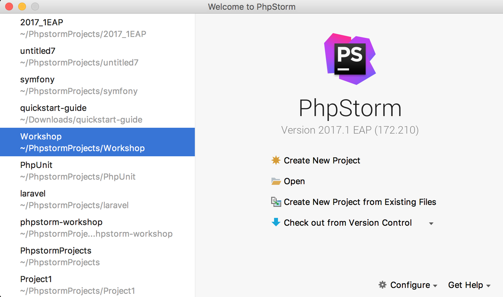

### 第2步：了解用户界面 {#d874831e220}

PhpStorm窗口主要分为几个逻辑区域：

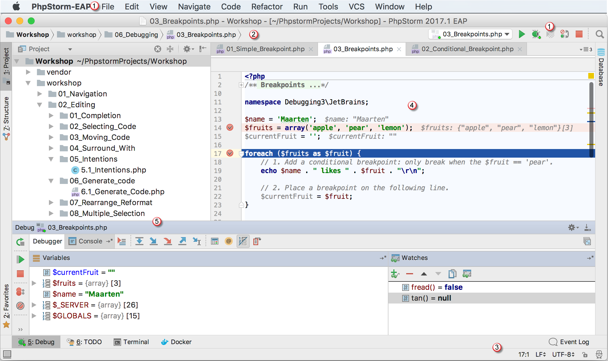

1. 菜单和工具栏：帮助我们执行各种命令；
2. 导航栏：用于在项目中导航；
3. 状态栏：包含有关PhpStorm、当前项目或编辑器中的文件、警告和错误消息的各种信息。
4. 编写代码的编辑器：它具有打开的文件之间切换的选项卡。
5. 工具窗口：帮助您探索和导航项目和文件结构、查看搜索和检查结果、运行、调试和测试应用程序、在交互式控制台工作等等。

### 第3步：代码智能提示 {#d874831e258}

PhpStorm负责处理例程，这样您就可以专注于重要的事情了。使用大量的PhpStorm编码功能，在不浪费时间的情况下创建无错误的应用程序。在基本项目中，您可以通过代码示例和指导方针，在许多PHP文件上交互地尝试这些特性。

#### 代码完成 {#d874831e263}

不管你正在处理的文件类型是什么，[代码完成](https://www.jetbrains.com/help/phpstorm/auto-completing-code.html)都可以帮您节省大量时间。PhpStorm中有两种类型的代码完成：[基本完成](https://www.jetbrains.com/help/phpstorm/auto-completing-code.html#basic_completion)和[智能完成](https://www.jetbrains.com/help/phpstorm/auto-completing-code.html#smart_completion)。

基本完成 \(`⌃Space`\) 显示当前上下文的代码完成选项，并以粗体显示当前类型的成员：

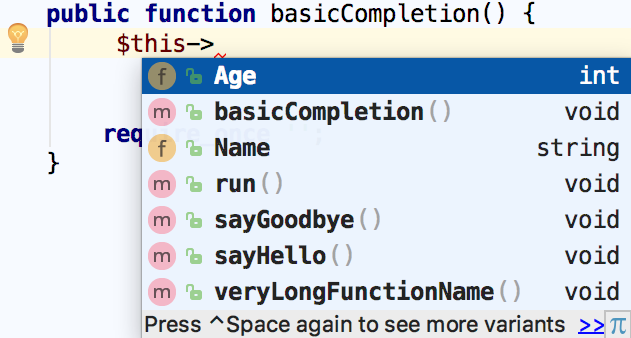

再次点击快捷键\(`⌃Space`\)将显示更多变量。

如果要测试代码的基本完成功能，打开`workshop/02_Editing/01_Completion/1.1_Basic_Completion.php`，然后按照注释中的说明进行操作。

智能完成将分析当前工作的上下文，并在此分析的基础上过滤函数和变量列表以匹配表达式类型，提供更准确的建议。

如果要测试代码的智能完成功能，打开`workshop/02_Editing/01_Completion/1.3_Type_hinting.php`，然后按照注释中的说明进行操作。

#### 意图动作 {#d874831e317}

PhpStorm会密切关注你目前正在做的事情，并提出智能建议，称为意图动作，帮助你节省更多时间。意图动作允许你对正确的代码应用自动更改（与代码检查相比，代码检查提供了可能不正确的代码的快速修复）。

代码引用了不存在的文件？

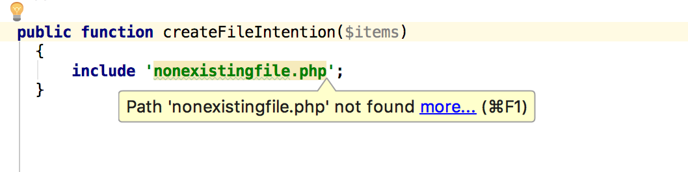

对于PhpStorm来说不是问题，按`Alt+Enter`然后选择 **Create file &lt;filename&gt;:**  

查看完整的[意向动作](https://www.jetbrains.com/help/phpstorm/intentions-settings.html)列表 \(Windows and Linux系统在 **File Settings \| Editor \| Intentions** ，macOS系统在 **PhpStorm \| Preferences \| Editor \| Intentions**\)。

如果要测试各种意向动作，打开 `workshop/02_Editing/05_Intentions/5.1_Intentions.php`，然后按照注释中的说明进行操作。

### 第4步：保持代码整洁 {#d874831e362}

PhpStorm会实时监视代码，并试图保持它的准确和干净。它可以检测潜在的错误和问题，并为它们提出快速修复建议。

每当PhpStorm发现未使用的代码、无限循环、隐藏的上部范围、条件表达式中的赋值运算符 **=** 以及许多其他可能需要您注意的事情时，你会看到一个灯泡，点击灯泡或者使用快捷键**`⌥⏎`**就可以快速修复该问题。

你忘了使用声明了吗？

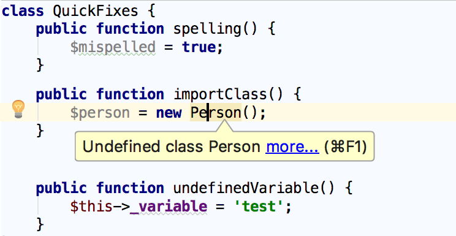

按`Alt+Enter`，然后选择导入类：

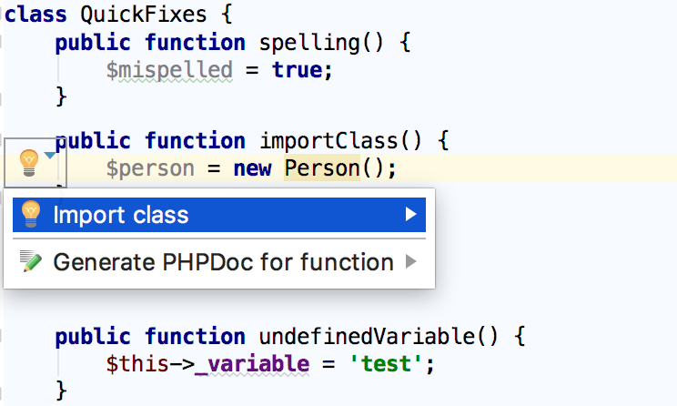

在列表中，选择要导入的类：

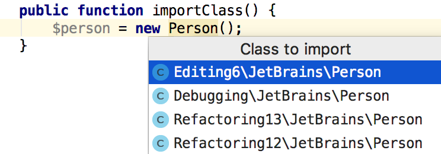

PhpStorm导入所选的类并添加一个 **use** 语句：

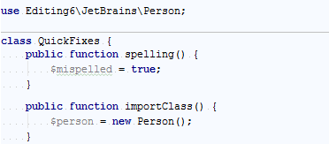

打开 `workshop/03_Inspections/02_Quick_Fixes.php` 尝试更多实例。

查看[检查页面](https://www.jetbrains.com/help/phpstorm/inspections-settings.html)上可用的[检查](https://www.jetbrains.com/help/phpstorm/code-inspection.html)的完整列表。\(Windows and Linux系统在 **Settings \| Editor \| Inspections** ，macOS系统在 **PhpStorm \| Preferences \| Editor \| Inspections**\)。你可以禁用或者启用一些检查，另外还可以调整每次检查的严重性，你可以将其修改为错误或者警告。

### 第5步：生成一些代码 {#d874831e421}

使用PhpStorm中提供的代码生成选项，让你更轻松，更方便地编写代码。**Code \| Generate（快捷键**`⌘N`**）**帮助你生成构造函数、getters、setters，PHPDoc 注释以及建议重写/实现某些方法\(`⌃O` / `⌃I`\)：

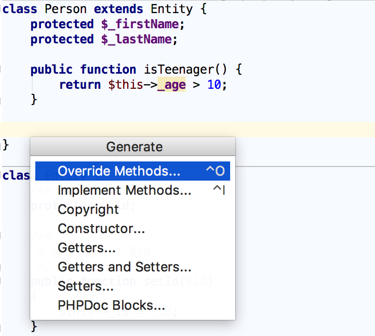

打开 `workshop/02_Editing/06_Generate_code/6.1_Generate_Code.php` 尝试更多实例。

使用 _live templates \(实时模板\)_ 生成完整代码构造\(**Code \| Insert Live Template** 或者 快捷键 **⌘J**\)。查看[实时模板](https://www.jetbrains.com/help/phpstorm/settings-live-templates.html)上可供使用的活动模板列表 \(Windows and Linux系统上**File \| Settings \| Editor \| Live templates**， macOS系统上**PhpStorm \| Preferences \| Editor \| Live Templates**\)。如果你发现你需要一些对你的开发特别重要的东西，就用自己的模板来扩展这组模板。

打开 `workshop/04_Live_Templates/01_Code_Expansion/1.1_Code_Expansion.php` 和 `workshop/04_Live_Templates/02_Creating_Live_Templates` 尝试更多实例。

另外，如果需要用完整的构造函数包围代码，选择 **Code \| Surround With** 或者 **快捷键⌥⌘T**，然后从弹出列表中选择所需语句。

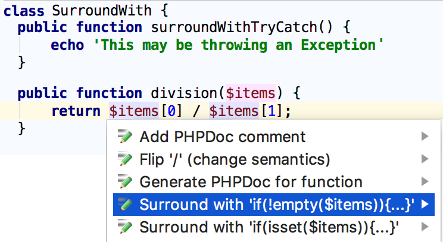

打开 `workshop/04_Live_Templates/03_Surround_Templates/3.1_Simple_template.php` 尝试更多实例。

### 第6步：查找通过： {#d874831e490}

当你的项目很大时，或者当您必须使用其他人编写的代码时，能够快速找到所要查找的内容并深入到代码中是至关重要的。这就是为什么PhpStorm附带了一组[跳转](https://www.jetbrains.com/help/phpstorm/navigating-through-the-source-code.html)功能，这些特性将帮助您在任何代码中找到自己的方法，不管代码有多复杂。

#### 基本搜索 {#d874831e498}

为了找到项目中特定符号的使用位置，PhpStorm建议通过[Find Usages](https://www.jetbrains.com/help/phpstorm/find-usages.html)进行全面搜索\(**快捷键⌥F7**\)

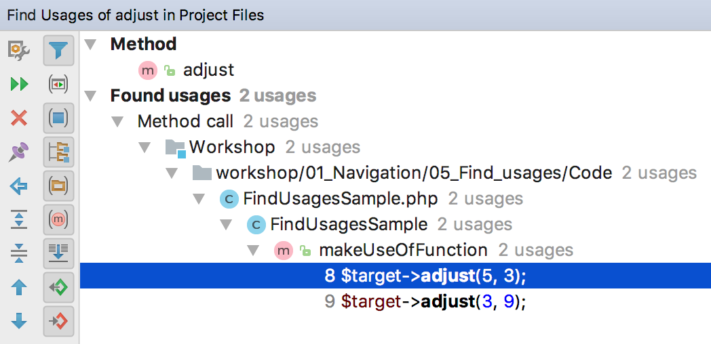

还可以选择只在当前文件 \(**快捷键⌘F**\)、目录、任意范围或整个项目 \(**快捷键⇧⌘F**\) 中搜索。

打开 `workshop/01_Navigation/05_Find_usages/5.2_Find_Usages.php` 或者 `workshop/01_Navigation/05_Find_usages/5.1_Highlight_Usages_in_File.php` ，然后按照注释中的说明进行操作。

#### 项目导航 {#d874831e527}

### 第7步：调试应用程序

你的应用程序是否完全符合预期目的？如果没有，你将不得不进行一些调试以便找出导致问题的原因。幸运的是，我们的示例项目已经安装并配置了[Xdebug](https://confluence.jetbrains.com/display/PhpStorm/Xdebug+Installation+Guide)。

#### 配置PHP解释器 {#d874831e673}

在我们的项目中，Vagrant已经包含一个PHP解释器，你只需要告诉PhpStorm它在哪里。

1. 打开 [PHP页面](https://www.jetbrains.com/help/phpstorm/php.html)，然后单击CLI Interpreter字段旁边的。 \(Windows and Linux系统：**Settings \| Languages and Frameworks \| PHP**，  macOS系统： **PhpStorm \| Preferences \| Languages and Frameworks \| PHP**\) 

### 第8步：测试代码 {#d874831e884}

PhpStorm 集成了最受欢迎的 PHP 测试框架： [PHPUnit](https://confluence.jetbrains.com/display/PhpStorm/Testing+PHP+Applications)、[Behat](https://confluence.jetbrains.com/display/PhpStorm/Using+Behat+in+PhpStorm)、[PHPSpec](https://www.jetbrains.com/help/phpstorm/using-phpspec.html)、[Codeception](http://codeception.com/)。

#### 写入你的测试

跳转到要测试的类并按下 **⇧⌘T** 。从弹出列表中，选择 **Create New Test**：

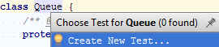

在打开的对话框中，填写所有字段，然后单击 **OK**。PhpStorm将会生成打开一个 **&lt;class\_to\_test&gt;Test**，你可以直接根据你的需要编写测试代码。

如果你要尝试使用PhpStorm编码助手编写测试，请打开 `workshop/08_Testing/01_Writing_Tests.php` ，然后按照注释中的说明进行操作。

### 第9步：使用版本控制 {#d874831e884}

如果你需要使用版本控制，PhpStorm集成了多种[版本控制系统](https://www.jetbrains.com/help/phpstorm/version-control-integration.html)：Git \(或GitHub\)、Mercurial、Perforce、TFS、Subversion \(SVN\) 和CVS，如果需要了解更多关于版本控制的设置，请阅读[版本控制](https://www.jetbrains.com/help/phpstorm/version-control-reference.html)（Windows和Linux系统：**Settings \| Version Control**，macOS系统：**PhpStorm \| Preferences \| Version Control**）

打开 **VCS** 菜单即可看到提供的命令。比如：在 **Changes** 弹出窗口，你可以看到所做的更改、提交、创建 等等\(**VCS \| Show Changes View** 或者 **⌘9**\)。

### 第10步：享受开发的乐趣 {#d874831e884}

在这里我们给出了非常简洁的概述关于一些PhpStorm重要的工具，仅仅是让你快速开始。还有大量的重要特性能使你的生活更加方便，使代码漂亮和干净。

如果有什么问题，请访问 [PhpStorm论坛](https://intellij-support.jetbrains.com/hc/en-us/community/topics/200367219-PhpStorm)、[twitter](https://twitter.com/phpstorm)、[blog](https://blog.jetbrains.com/phpstorm/)，在这里你可以找到新闻、PhpStorm更新和有用的提示和技巧。

